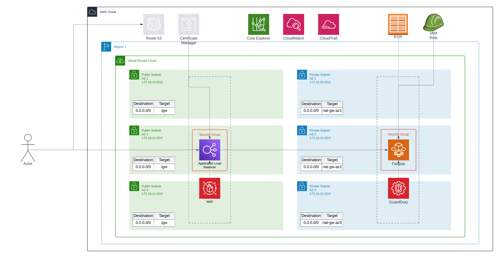

# AWS Tech Test

> [!NOTE]
> This project has been tested using an "A Cloud Guru" sandbox account, for this reason DNS records and subsequently TLS certificates have not been created as this feature was not available.

Contained within the `app/` directory is a Dockerfile that serves as the solution for the first task.

A `scratch` image was used as the final image in a multi-stage Dockerfile. This was made possible by ensuring a fully statically-linked binary.

## Setup

Ensure you have at least terraform version `v1.9.6` installed locally, this can be verified with:

```bash
terraform version
```
Once this is validated within the infra directory, run the command.

```bash
terraform init
```
Once the dependencies have been resolved, the infrastructure can be applied with:

```bash
terraform apply
```
After a successful apply, contained within the output should be a URL from the loadbalancer with which you can then access the web application. In order to hit the application you would need to provide the appropriate query parameter such as `?app=poc` or `?app=jam`.

> [!IMPORTANT] This is used as a workaround for the lack of a DNS hosted zone within Route 53 to allow for subdomains.

As an example you would access one of the applications using:

```bash
http://poc-1261106563.us-east-1.elb.amazonaws.com/?app=poc
```


## Current Architecture

* VPC with two public subnets across different availability zones
* EC2 instances running the applications
* Elastic Load Balancer for traffic distribution
* Security Group allowing HTTP traffic
* Simple deployment using user data script on EC2 instances

## NOTES

* Due to time constraints and sandbox limitations only one environment has been setup
* A CI/CD pipeline will need to be setup to deploy the infrastructure across the environments
* Fargate has been chosen as the platform to host the applications. The reason for this choice is that it provides a good general solution. However, depending on usage and complexity of networking between services, lambda functions or EKS may provide a better platform for some or all of the services.
* Three availability zones have been utilised with autoscaling enabled dependent on CPU and Memory utilisation to allow scaling between 2-4 replicas. To properly tune this however further information would be needed on the current utilisation of the services.
* To allow developers to manage their own infrastructure, modules have been written that they can use to build and deploy their own services with allowed options for them to configure. Further details would be needed on the architectural decisions developers would like to make when deploying applications if greater flexibility is needed.

## Proposed Architecture

* ALB used to direct traffic and distribute traffic across replicas
* Web Application Firewall used to block common attacks found in the OWASP Top 10, with ability to add further rules.
* Private subnets added to avoid exposing application directly to the internet
* A NAT gateway has been deployed per public subnet for greater resiliency
* Increased the number of Availability Zones to three for greater resiliency
* Application is deployed in a scratch docker image to significantly reduce attack surface and image size
* Image is scanned within ECR to detect possible vulnerabilities
* IAM role has minimal permissions required to carry out it's task
* Fargate is used as it's a good general solution (Further details would be needed on application architecture)
* Guardduty is used to monitor the AWS account and ECS for security breaches
* CloudWatch is used for monitoring/logging
* CloudTrail is used for auditing
* Cost Explorer is used to monitor costs

